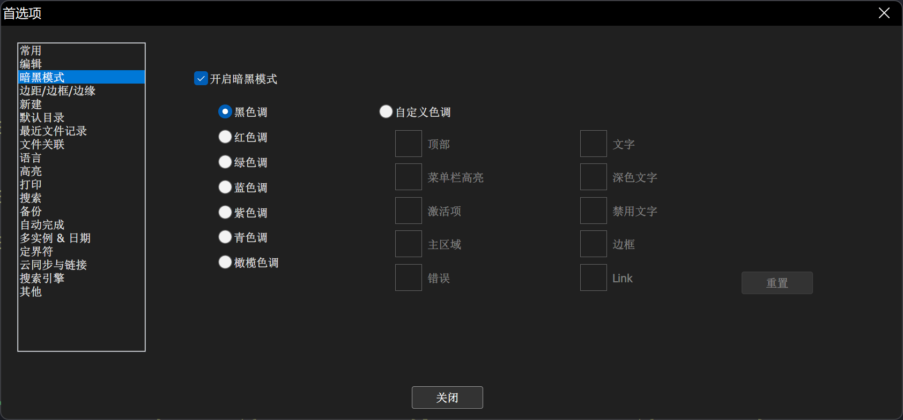
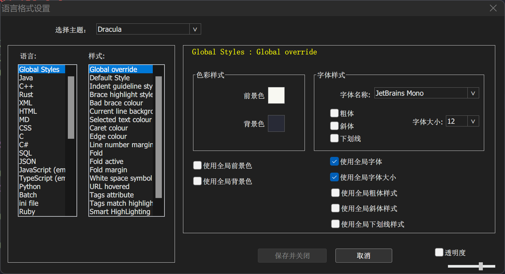
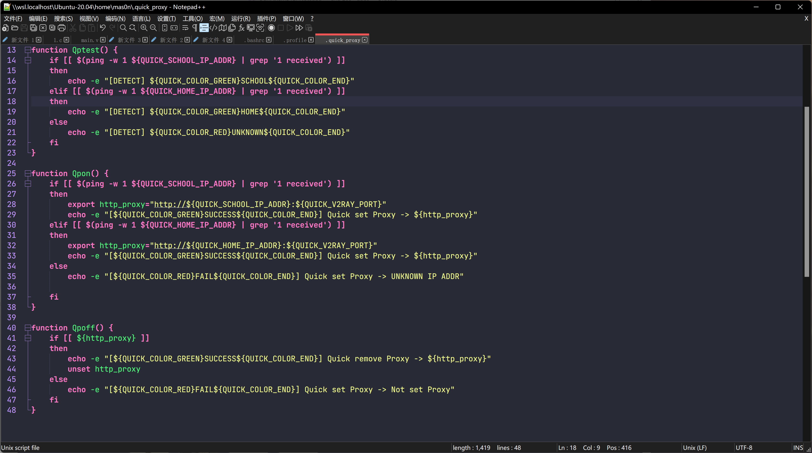

# notepad++美化

首选项开启暗黑模式

下载主题文件[Dracula](https://draculatheme.com/notepad-plus-plus)

将[`Dracula.xml`](https://raw.githubusercontent.com/dracula/notepad-plus-plus/master/Dracula.xml)放至`%AppData%\Notepad++\themes`下

选择对应主题，选择`JebBrains Mono`字体，适当改变字体大小

勾选**使用全局字体**，**使用全局字体大小**

保存即可

## 效果预览

