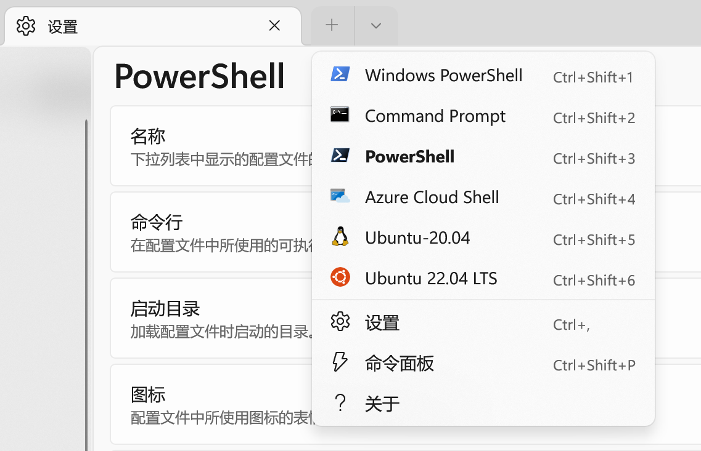
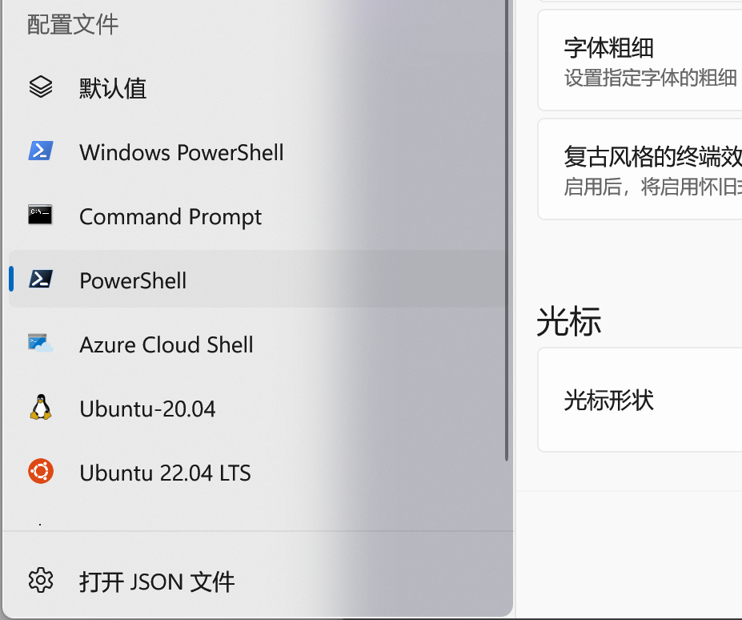
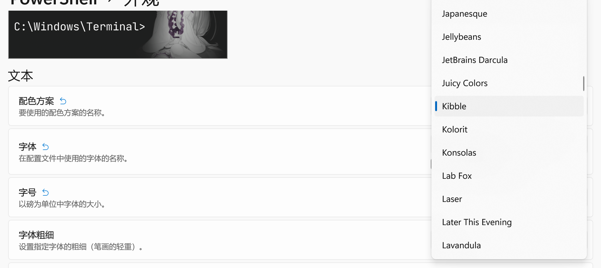
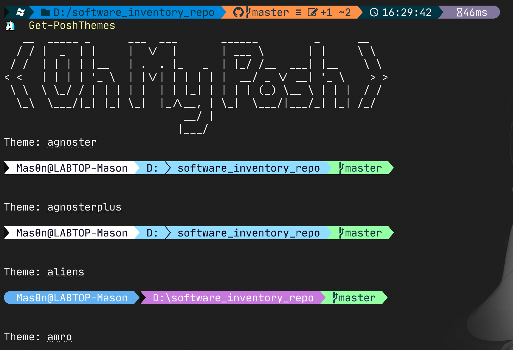
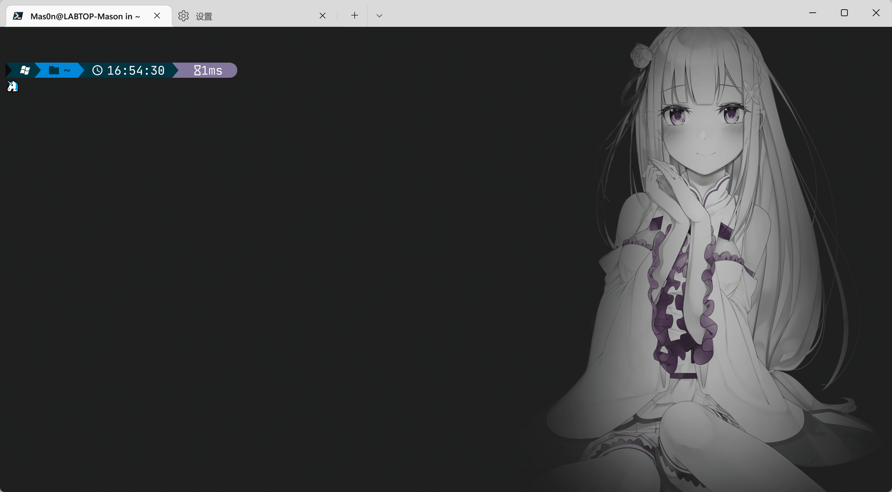

# Windows Terminal 配置指南

## Install PowerShell 7

选择相应版本安装

[Release v7.2.2 Release of PowerShell · PowerShell/PowerShell (github.com)](https://github.com/PowerShell/PowerShell/releases/tag/v7.2.2)

安装完成后，打开Windows Terminal将看到选项



## 美化 Terminal

### 选择配色方案

参考配色方案：[Windows Terminal Themes](https://windowsterminalthemes.dev/)

点击`Download .json of themes`下载全部配色方案

点击**打开JSON文件**



将所有配色方案添加到`schemes`属性中

选取配色



### 设置字体与字号

- 为了美观
- 为使用oh-my-posh主题作准备

oh-my-posh部分主题包含一些Unicode Icon，详细可参考文章

[Powerline fonts & Nerd fonts 简介 - 掘金 (juejin.cn)](https://juejin.cn/post/6844904054322102285)

下载对应nerd字体，例如`JetBrainsMono`

[Releases · ryanoasis/nerd-fonts (github.com)](https://github.com/ryanoasis/nerd-fonts/releases/)

安装字体后重新运行Terminal，前往设置中设置字体及字号


### 设置背景

略


### Install oh-my-posh

参考详细的文档：[Introduction | Oh My Posh](https://ohmyposh.dev/docs/)

执行命令

```powershell
winget install JanDeDobbeleer.OhMyPosh
```


### 选择主题并持久化

键入 `Get-PoshThemes` 预览所有预置主题



键入`Set-PoshPrompt -Theme %ThemeName%`切换主题

预置主题目录位于`$env:POSH_THEMES_PATH`


为了持久化加载主题，

下面编写PowerShell Script

在`~/Document/PowerShell`文件夹下创建`Microsoft.PowerShell_profile.ps1`

键入示例代码并保存

```powershell
Import-Module oh-my-posh

oh-my-posh init pwsh --config $env:POSH_THEMES_PATH/unicorn.omp.json | Invoke-Expression
```


## 智能提示及历史记录

终端运行

```powershell
Install-Module -Name PowerShellGet -Force
```

安装完成后编辑 `Microsoft.PowerShell_profile.ps1`，添加如下代码并保存

```powershell
Import-Module PSReadLine

# Set KeyHandler
Set-PSReadLineKeyHandler -Key UpArrow -Function HistorySearchBackward
Set-PSReadLineKeyHandler -Key DownArrow -Function HistorySearchForward
Set-PSReadlineKeyHandler -Key Tab -Function MenuComplete
# Set History Hints
Set-PSReadLineOption -PredictionSource History
```


## 预览

